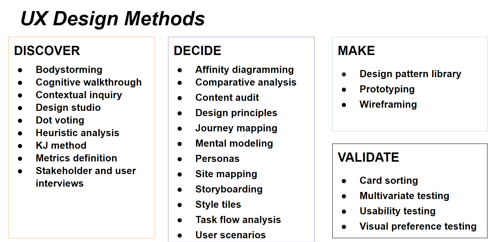
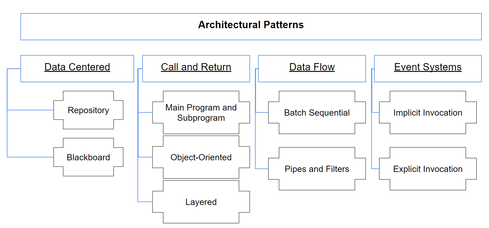
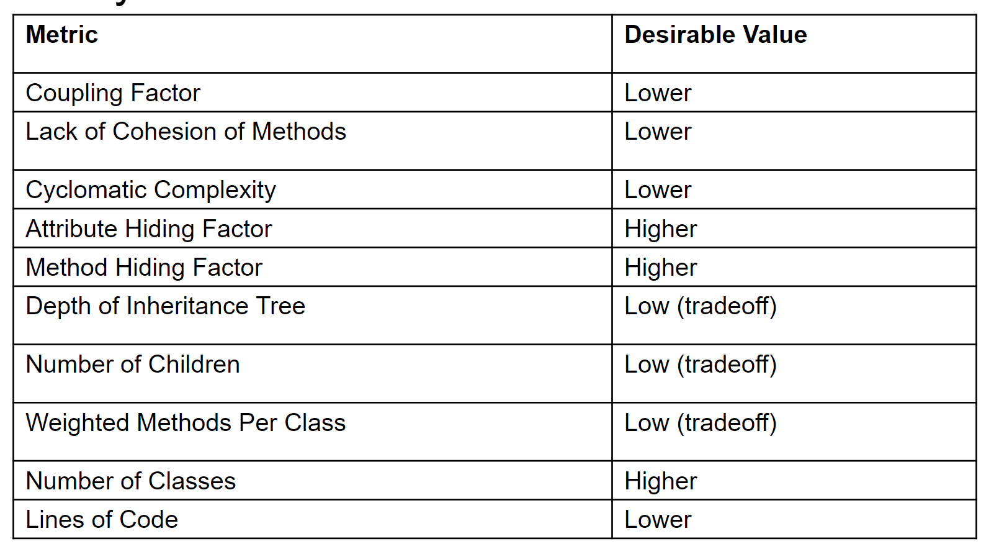

## Engineering Basics

#### 1. Setup

#### 2. Shells

##### Essential commands.

* **`ls`**: list content of a directory.
* **`cd`**: change directories to a new path.
* **`mkdir`**: make a new directory.
* **`pwd`**: output current directory
* **`cp`**: copy files
* **`rm`**: rm files
* **`touch`**: make a new file/update status**
* **`cat`**: output the contents of a file.
* **`head`**: output the first lines of a file.
* **`tail`**: output the last lines of a file.
* **`grep`**: search files for a key phrase.
* **`wget`**: retrieve file from the web.
* **`cut`**: extract output of a file (columns)
* **`awk`** and **`sed`**: Magic commands for extracting, searching, and transforming content.

```bash
# Create a graphical directory tree from your current directory
ls -R | grep ":$" | sed -e 's/:$//' -e 's/[^-][^\/]*\//--/g' -e 's/^/ /' -e 's/-/|/'

# Command can run sequentially or conditionally:
command1 ; command2   # do command1 and command2 independently and sequentially
(command1 ; command2) # in a sub-shell
command1 || command2  # do command2 only if command1 fails
command1 && command2  # do command2 only if command1 succeeds

# Pipes and redirects change standard in and standard out from defaults.

command              # default standard in and standard out
command < inputFile  # redirect of inputFile contents to command as standard in
command > outputFile # redirect command output to outputFile as standard out
command1 | command2  # pipes output of command1 as standard in to command2
command &            # run in background, typically used for applications
```
#### 3. Version Control with Git

#### 4. Markdown and IDES

#### 5. Virtual Environments

#### 6. Task Management

## REST APIs
GET, POST, PUT, DELETE

## Bots
A bot is an agent of automation. A bot can perform automated, repetitive, predefined tasks.

#### Relationship between CLI and Bots
Bots can simplify
- complexity in complex tools (command line tools)
- integration between complex systems
- deployment and configuration (no app store; no install, passwords, or setup)

#### Bots Risks
- Information/interactions not discoverable
- Interactions may be ephemeral
- Reduced opportunity for learning
- Direct manipulation better for complex tasks
- May bring new disruptions and complexities
- Ethical and moral training

## Design and UX Methods

#### Wireframes
A wireframe is a view schematic that captures all layout and content decisions of that view.

#### Storyboards
A storyboard illustrates the timeline of user performing a task as a sequence of frames.

#### Personas
A persona is arch-user type which represents a segment of a user population, and allows role-play during task planning and UX design.

#### Flow Maps
A flow map describes the wayfinding activity of a user and transitions between UI states.

#### Other Design Methods


## Software Design

#### Diagrams
Drawing and diagramming is essential task in software development.

Types: Class Diagrams, Sequence Diagrams, State Diagrams

#### UML (Unified Modeling Language) 2.0
A standard for modeling object-oriented software.
Evaluation: intention-revealing naming, Single Responsibility.

#### Design Patterns
Design patterns are descriptions of communicating objects and classes that are customized to solve a general design problem in a particular context.

The design pattern identifies the participating classes and instances, their roles and collaborations, and the distribution of responsibilities

##### Pattern Families
- Creational: Concerned with the process of object creation
- Structural: Deal with the composition of classes or objects
- Behavioral: Characterize the ways in which classes or objects interact and distribute responsibility

##### Some Patterns
- Singleton Pattern
- Visitor Pattern
- Builder Pattern
- Abstract Factory Pattern
- Adapter Pattern
- Strategy Pattern

#### Architecture


##### Data-Centered
- Repository: Data held in central database is accessible by all components.
- Blackboard: Blackboard is used as a global database for sharing different information as input data, partial solutions, alternatives and final solutions. Knowledge source, Blackboard, Control component drives

#### Call and Return
- Main and Subprogram
- Object-Oriented
- Layered Model Description

#### Data-Flow
- Pipe-And-Filter: Components (Filters), Connectors (Pipes)
- Batch Sequential: Each component completes transformation of input before passing to output.

## Software Metrics and Refactoring
#### Root Canal Refactoring
Painful, expensive, the result of long periods of neglect.

When: Refactoring for protracted periods; time specifically set aside.

Why: Typically after code has gotten difficult to maintain.

Not considered best practice.Studies suggest that it is not common.

#### Floss Refactoring
Easy to do, regular, something people know they should do.

When: Continuously; Think "every few minutes".

Why: It helps achieve an immediate goal.

Considered best practice. Studies suggest that this is common.

#### Code Metrics
- Lines of Code
- Halstead Complexity: Number of operations and symbols in code.
- Cyclomatic Complexity: Number of independent paths in program.
- Dep Degree: Number of data flow paths in code.

#### OO Metrics
- Weighted Methods Per Class: essentially number of methods.
- Cohesion: Degree to which the tasks performed by a single module are functionally related.
- Coupling: Measure of interdependence between two objects.
- Attribute Hiding Factor: Measure of the proportion of attributes that are "invisible" from other classes or objects
- Method Hiding Factor: Measure of the proportion of methods that are "invisible" from other classes or objects

#### Summary


#### Process Metrics
- Velocity: Units of work completed per iteration.
- Burndown: Work done versus outstanding work overtime.
- Fault-slippage: #Bugs making it into production.

## Introduction to Testing
#### Types of Testing
- Unit Testing

    > Confirm that the component or subsystem is correctly coded and carries out the intended functionality

- Integration Testing

    > Test the interfaces among the subsystems.

- System Testing

    > Determine if the system meets the requirements (functional and nonfunctional)

- Acceptance Testing

    > Demonstrate that the system meets the requirements and is ready to use.

#### Styles of Testing
###### Black Box Testing
- Focus: I/O behavior
- Goal: Reduce number of test cases by equivalence partitioning

###### White Box Testing
Advantages:
- Based on the code: can be measured objectively and automatically
- Can be used to compare test suites
- Allows for covering the coded behaviors

Different kinds:
- Control-flow based
- Data-flow based
- fault based

#### TDD(Test-Driven Development)
- Write tests before writing code
- Tests are automated
- Often use "x" Unit framework
- Must run at 100% before proceeding

#### BDD(Behavior-Driven Development)
- example-based communication with testers, managers
- Features and scenarios written in plain-text
- Tools can execute features as automated tests.

Goals:

- Improve feature understanding
- Describe how system behaves rather than how it works
- Must run at 100% before proceeding

## Software Processes
#### The Roots of Agile
- Individuals and interactions over processes and tools
- Working software over comprehensive documentation
- Customer collaboration over contract negotiation
- Responding to change over following a plan


#### Stories
Card - Conversation - Confirmation
###### Attributes of an user story or epic
INVEST

- Independent
- Negotiable
- Valuable for purchasers or users
- Estimate-able
- Small
- Testable

#### Extreme programming practice: Corollary
- Real Customer Involvement
- Incremental Deployment
- Team Continuity
- Shrinking Team
- Root-Cause Analysis
- Shared Code 
- Code & Test
- Single Code Base
- Daily Deployment
- Negotiated Scope Contract

#### Lean Principles
- Eliminate Waste
- Create Knowledge
- Build Quality In
- Defer Commitment
- Deliver Fast
- Respect People
- Improve the System

## Continuous Integration
A practice where developers automatically build, test, and analyze a software change in response to every software change committed to the source repository. A continuous integration server monitors the status of every commit and reports any problems.

#### Claimed Benefits
- Detecting defects and fixing them faster
- Health of software is measurable
- Reduce assumptions about environment
- Reducing repetitive processes saves time, costs, and effort
- CI can enable you to release deployable software at any point in time.
- CI offers a global mechanism for feedback about failure, enabling developers to have more confidence in making their changes.

#### Principles
- Commit Code Frequently
- Don’t commit broken code
- Fix broken builds immediately
- Write automated developer tools
- All tests and inspections must pass
- Run private builds
- Avoid getting broken code

#### Risks of Not doing CI
- Little or no confidence in whether we could even build the software
- Lengthy integration phases before delivering the software internally (to test teams) or externally (customer), during which nothing else got done
- Inability to produce and reproduce testable builds
- Fear of making changes or refactoring the database or code
- Difficulty in populating the database with diff. sets of data
- Difficulty in maintaining development and testing environments
- Late discovery of defects
- Lack of project visibility (awareness of changes)
- Low-quality software 

## Configuration Management
#### Traditional Configuration Management (CM)
- Identify all items related to software.
- Manage changes to those items.
- Enable variations of items and changes. 
- Maintain quality of versions and releases.
- Provide traceability between changes and requirements.

#### Modern Configuration Management
In traditional configuration management, the process is not fully triggered until deployment.

In modern configuration management, lightweight CM is integrated throughout the  software process.

#### Package Manager
Binary: apt-get, choco (windows), brew (mac)

Source: bower(web), nuget(C#), pip(python), npm(node.js), maven(Java), RubyGems

#### Task Manager
Tools: make, ivy, ant, grunt
Tasks: Validation, testing, tool chains(antlr example), less to css translation, deployment, staging

#### Configuration Management Concepts
- agentless: Operations can be applied to remote client without any local service running.
- configuration polling: Client queries periodically master server for new configuration state.
- idempotent: Applying operations multiple times will not affect result - (e.g. if python is already installed, script will not fail).
- orchestration: Controlling schedule of change rollout while ensuring operational stability.

#### Configuration Tools
Ansible, Puppet, Chef, 

## Productivity
#### Personal Productivity
- TODO
- Deliberate Work

#### Personal Software Process (PSP)
#### Team Software Process (TSP)
#### Social Software Processes