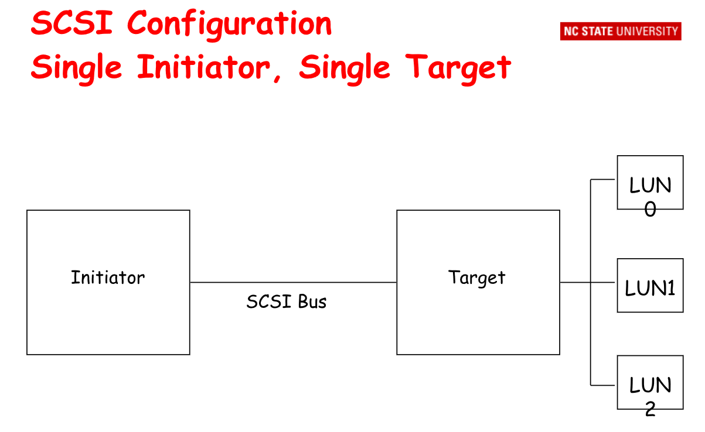
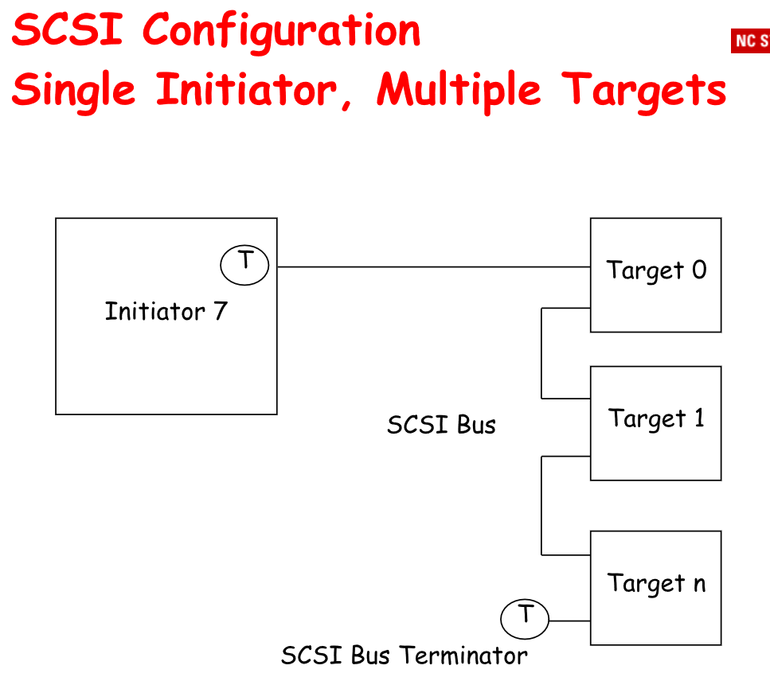
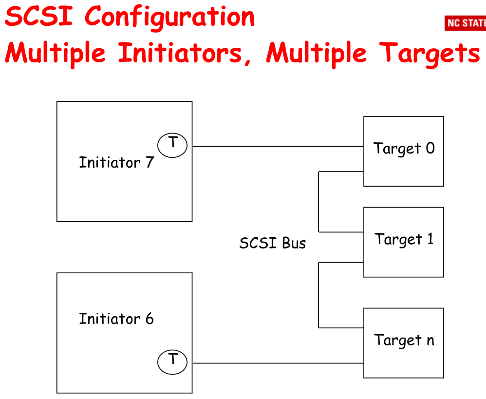

## **SAN(Storage Area Network)**

Organize connection between **storage** and **servers**.

---

### SCSI

SCSI is a kind of **block** protocol. Others are files or objects.

### iSCSI
- iSCSI, FCOE fiber channel over Ethernet
- substitution of fiber channel
- transport protocol(block protocol)
- SCSI, HiPPI, ESCO
- switched fabric
- block I/O

// to do
![SANarchictecture][]

### HBA
Host Bus Adapter: cable, hub, switch

### About SAN
1. Channel Oriented
    - channel processor
2. Network Oriented
    - full multiplexing
    - peer to peer
    - internetwork

### Benefits of SAN
1. high bandwidth
2. SCSI extension
3. resource consolidation
    - centralized storage, management
    - security(it's the server initiates the I/O)
4. scalability

