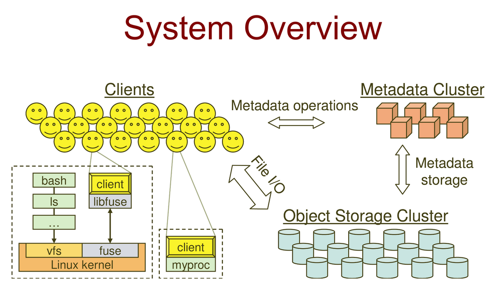
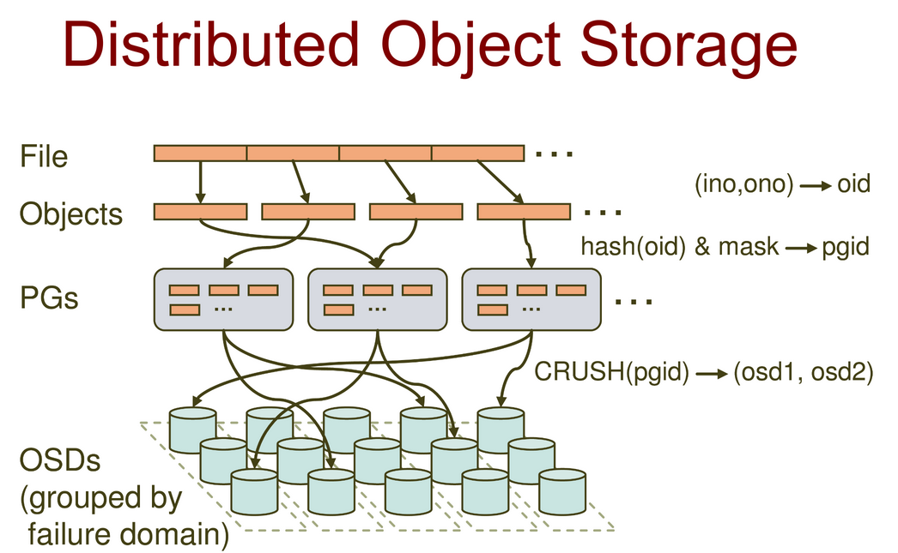

## **Ceph**

A kind of distributed file system, using **CRUSH algorithm**.

---

### Goal
- scalability
- capacity
- throughtput
- client performance
- individual
- emphasison HPO: shared files, lock-step manner(distribute jobs to processors then merge)
- reliability
- dynamic(peta byte)
- build incrementally
- failures
- quality and character of workload changes
- performance

### Key Ideas
- objects based storage system
- decouple data and metadata 
    - They are in different clusters
    - They have different retreving pattern

### Archictecture Overveiw

### Key features

##### Servers
- decouple data and metadata
    - CRUSH: controlled repliction under scalable washing
    - files striped onto predictable objects
    - CRUSH maps objects to storage device
- Dynamically distribute meta data management
    - metadata operations make up 50% of all operations
- dynamic subtree partitioning
- Object based storage
- Others: migrate, replication, failure detection, recovery

##### Clients
- ceph interface
    - POSIX compliant
    - decouple data and metadata
- user space implementation
>example:
>client sends request to MDS
>MDS returns capability, file index, size, stripe information...
>client reads/writes directly from/to OSD
>MDS mnage the capability
>client sends close
- synchronization
    - adhere to POSIX
    - include HPC-oriented extensions
    >consistency/correctness by defaults
    >optimally relax constraint, like clients could write to different locations
    >extension for both data and metadata
    - synchronize I/O used on multiple writes, or mix reader and writer.

### distribute metadata
- HDS used journaling
    - repetition metadata updates in memory
    - optimize on-disk layout for read access
- adaptively distributed cached metadata accessed nodes
- distributed objected storage
    - files are splited into objects
    - objects are members of placement groups
    - placement groups are distributed to OSD    
