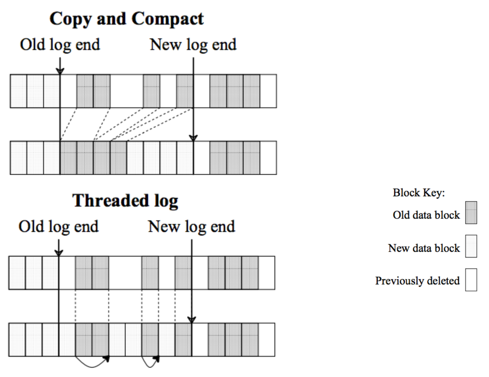
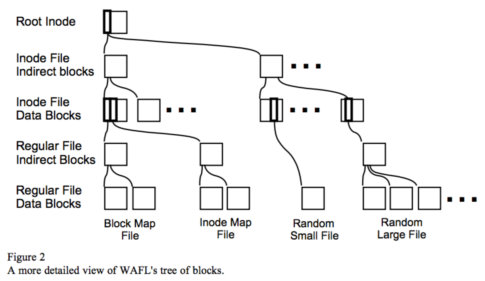
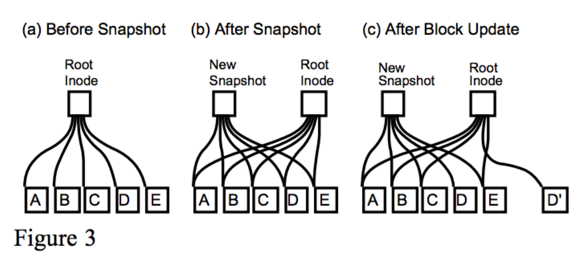
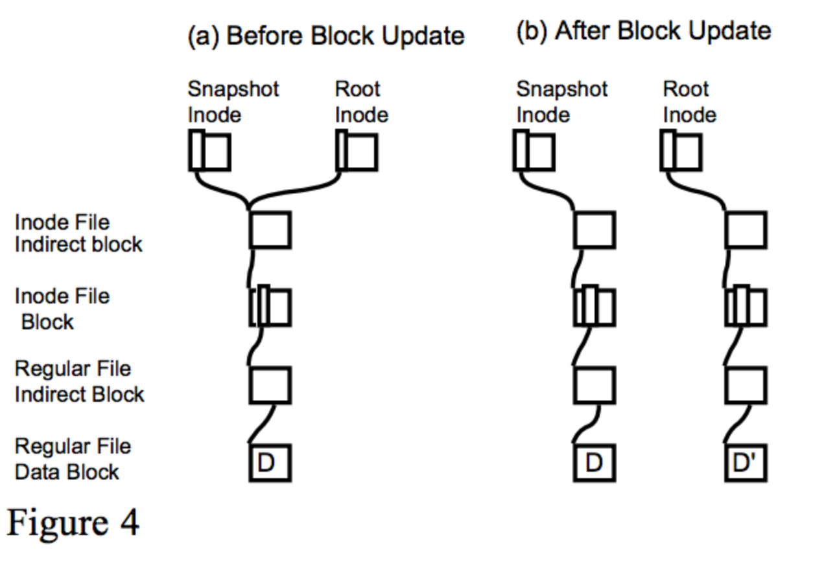

## **Log FS**

### Objectives
- optimize to the common case
- understand the program
- clean, simple solution

### Why LFS
- read will be satified by cache
- disk accesses are mostly writes

### Benefits of LFS
- faster write performance(similar read performance)
- faster crash recovery(worse than fsck)

### Existing System
#### 4 observations
- processor speed -> grow up
- disk seek -> not improve as fast
- main memory and cache size -> grow up
- Max kernels processor -> grow up

- difficult
small files
random disk I/O
much creation and deletion(meatadata)

#### Two general problems
- information is spread all servers: many small accesses

    > e.g. 5 small IOs to create a file
    
- synchronize writes

Bundles writes
- high write bandwidth
How
- delay write
- write large continuous extents

Circular log
- threading
- copy compacting
setment, level of inherizection

Segment Cleaning Issues
- when
- how many to change
- which segment
- how to copy

### WAFL_LFS

