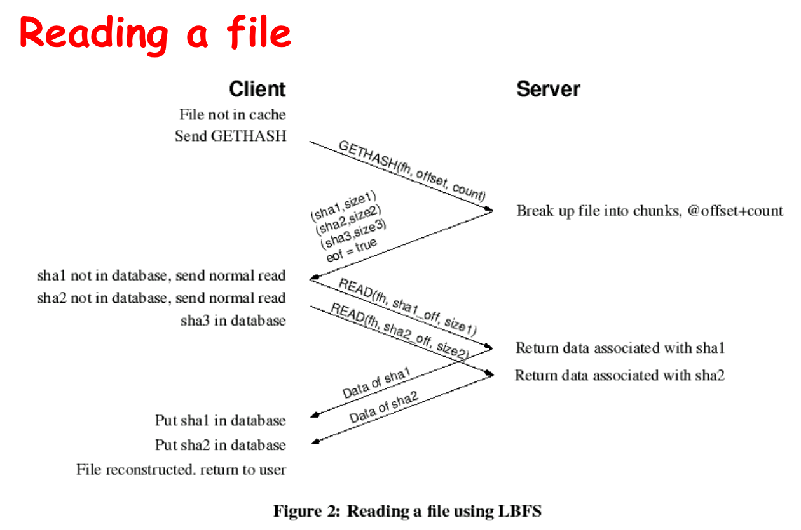
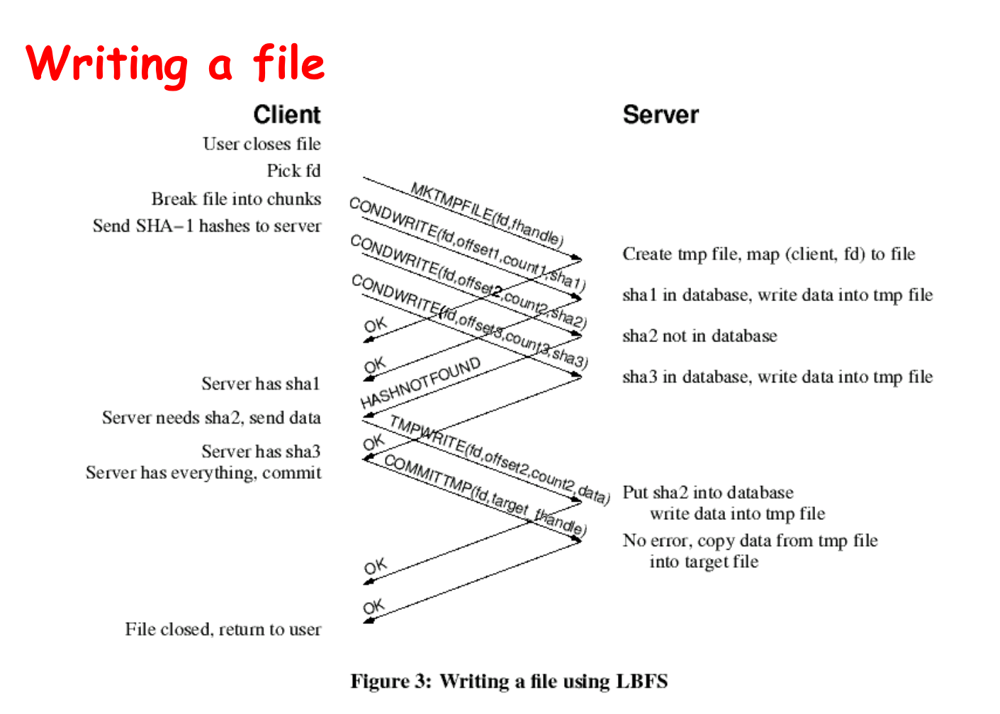

## **Data Deduplication**

### Working on slow networks
- Make local coppies: must worry about update conflicts
- Use remote login: only for text-based applications
- Use instead a LBFS: better than remote login; must deal with issues like auto-saves blocking the editor for the duration of transfer.

### LBFS
- LBFS file server divides the files it stores into chunks and indexes the chunks by hash value
- LBFS client similarly indexes a large persistent file cache
- LBFS never transfers chunks that recipient already has
    Tradeoff A: space (index) for time (bandwidth)
    Tradeoff B: meta info for data
- All transfers are compressed
    Tradeoff: processing for bandwidth

### LBFS Read and Write

### Other issues
- Protocol
- File Consistency
- Security
- Implementation

### Conclusion
- Under normal circumstances, LBFS consumes 90% less bandwidth than traditional file systems. 
- Makes transparent remote file access a viable and less frustrating alternative to running interactive programs on remote machines.

### Data Deduplication
- Advantages: Less disk, Less bandwidth, Less power
- Disadvantages: More time (compute), More complex, Latent channels
- Eager method: Dedup on write
- Lazy method: Dedup periodically
- Fixed: Index/offset determines the block boundary
- Variable: The data itself determines the block boundary

Tradeoffs?

