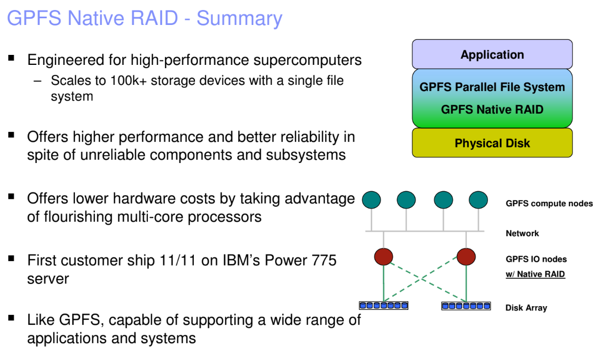

## **General Parallel File System Native RAID**

### Preview
- Why? Hard disk rates are lagging
- Challenge: how to design a reliable HPC storage system using 100K+ disk drives?
- Background: GPFS, Parallel Computing, RAID

### Traditonal Storage Stack

### Problems with Traditional RAID and Disks
- Performance: Traditional RAID rebuild significantly affects performance.

    > With 100,000 disks, disk drive failures are expected to happen on a daily basis.

    > Disks are getting bigger and hence, take longer to rebuild

- "Silent" data corruption in disk drives

### Solution

### Why Native RAID?
1. Higher Performance
Use declustered RAID to minimize performance degradation during rebuild
2. Extreme data integrity
Use end-to-end checksums and version numbers to detect, locate and correct silent disk corruption

### Summary
