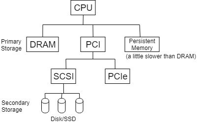

## **Storage Class Memory**

### Overview

### DRAM vs SCM
- similar latency
- cost: SCM << DRAM / bit
- SCM is denser than DRAM
- size: |SCM| >> |DRAM|

### Technologies
- Flash: NAD, NGD, 3D
- PCM
- magnetoresistive: RAM
- persistent RAM

Why don't use flash for SCM?
- No consistent semantics for writing a page, a word or a block.
- Address for data may change along with the program.
- wear-out problem.

### Persistent Memory vs Volatile Memory
- Persistent Memory
    - files
    - open/close/...
    - names(string -> file)
    - read/write
- Volatile Memory
    - malloc/free(heap)
    - call/return(stack)
    - global(static)
    - no name but logic address
    - load/storage