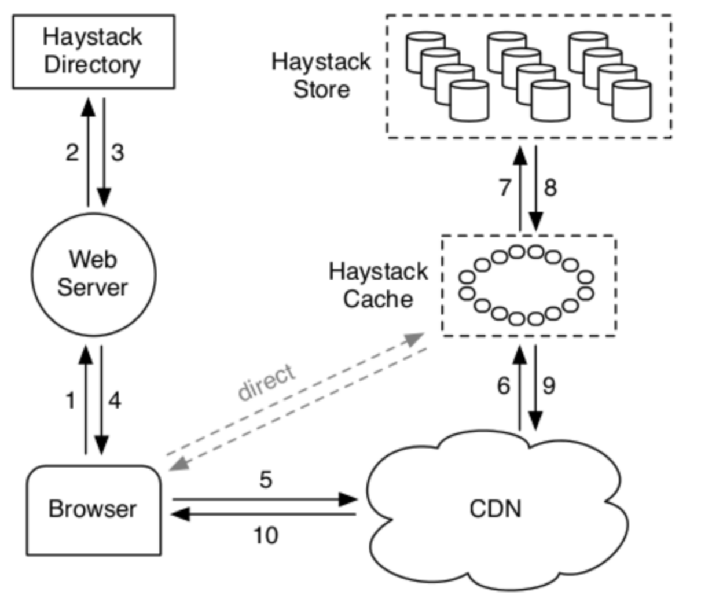
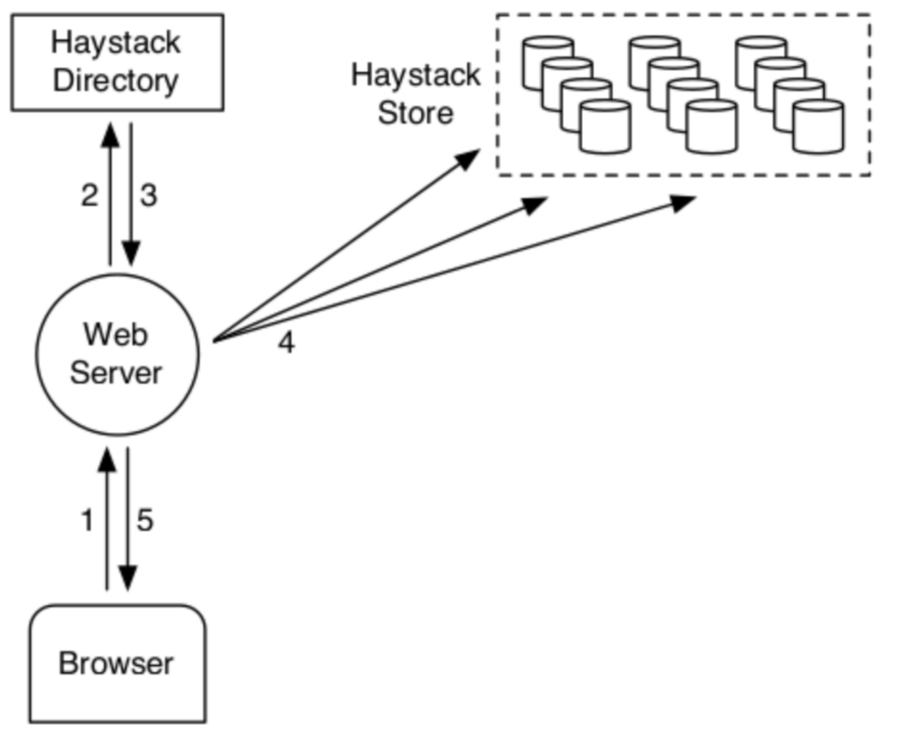
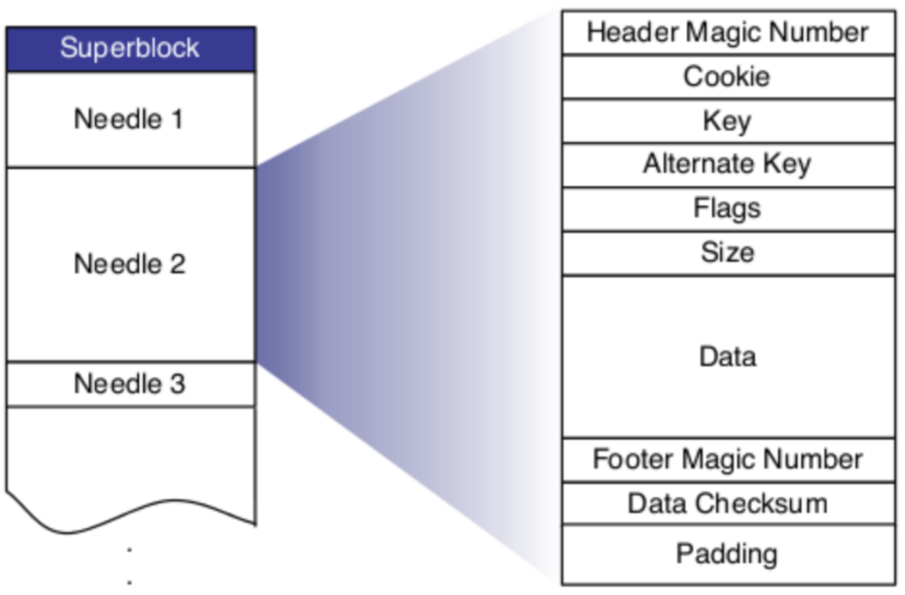

## **Haystack**

### Why Haystack?
- Find a needle in the haystack. Facebook storage.
- photo at FB(2010): 260 Billion images; 20PB storage; 60TB upload/week
- feature: long-tail access
- usage of CDN: if file is not in CDN, CDN asks for photo from servers.
- NFS:
    - a photo is a file
    - too much metadata
    - most meta data are not used
- bigger problem:
    - meta data has to be read from disk
    - disk IOs for metadata is a limiting factor
    - solutions: keep metadata in memory
- cache:
    - has limited impact on the number of IOs.
    - storage system has a long tail(will miss in CDN).
- url generated by haystack directory:
    http://<cdn>/<cache>/<machine_id>/<logical_volume, photo_id>.
    if it's not in cdn, go to haystack cache to get the file.

### Haystack store:
- persistent
- capacity(is divided into physical volumes)
    
    > e.g. 100TB in server -> 100 * 100GB volumes

- logical volume
    group of physical volume, distributed across different machines

### Directory:
- maintain metadata
- maintain free space
- 4 functions:
    - logical -> physical mapping
    - load balance writes
    - determine whether to fetch from CDN or cache
    - identify read-only store machines
- add new machines:
    - increase capacity
    - write-enabled
    - over time sapce is exhausted, then mark as read-only.

### In memory metadata
- logical volume id for photo
- offset
- size
- basic and simple
- read makes every specific request
- each volume store millions of photos
- a physical volume is one file(haystack - logical volume id)
- access the photo: open once the file, cache inode in the memory, then lseed for each photo

### Haystack Cache: internal CDN
- receive requests from broswer/CDN
- it caches the requests come from the browser
- photo is fetched from a write-enabled store:
    - shelter store
    - write-enabled store from read accesses
    - photos are most heavily accessed just after upload
    - fs generally perform better when doing reads or writes only.

### Implementation

