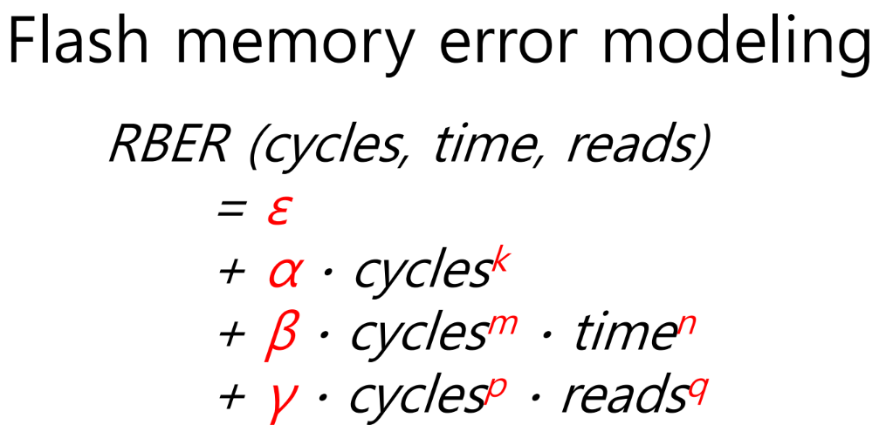

## **Design Tradeoffs for SSD Reliability**

### High-level objectives
- Understand the SSD-internal mechanisms behind fail-slow symptoms
- Examine SSD-internal reliability enhancement techniques
- Think about system- and device-level approaches for handling errors

### SSD's reliability issue
- How to make SSD reliable?
- Performance overhead?
- Across different chips and wear states?

### Flash memory error modeling

### SSD reliability enhancements
- Error correction code
    - predictable performance
    - is fixed at design-time
- Data re-reads
    - is much more powerful than ECC
    - increases latency for correcting erros
- Intra-SSD redundancy
    - Protects against random and sporadic errors
    - increases write amplification
    - increases read amplification on errors
- Background relocation

### Holistic reliability management
- Cold data
    - need protection against retention errors
    - least write amplification with redundancy
    - likely to be identified by GC
    - Selective redundancy for GC-ed data
- Read-hot data
    - Need protection against disturbance errors
    - number of data re-reads can be used as proxy
    - likely to be identified by scrubber
    - cost-benefit scrubbing
- Write-hot data
    - no special attention required